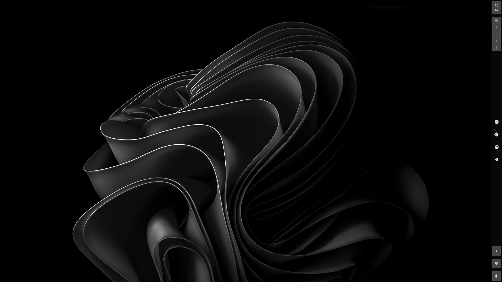
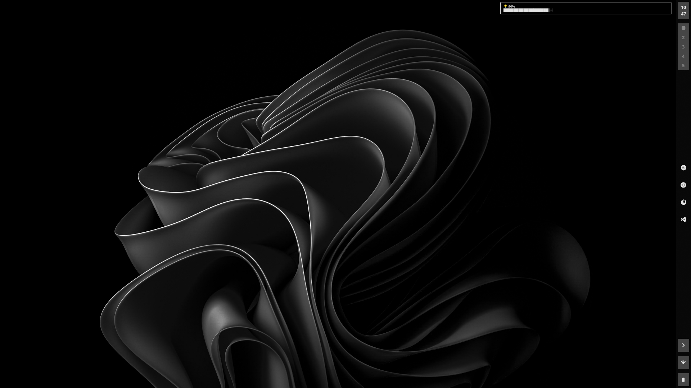
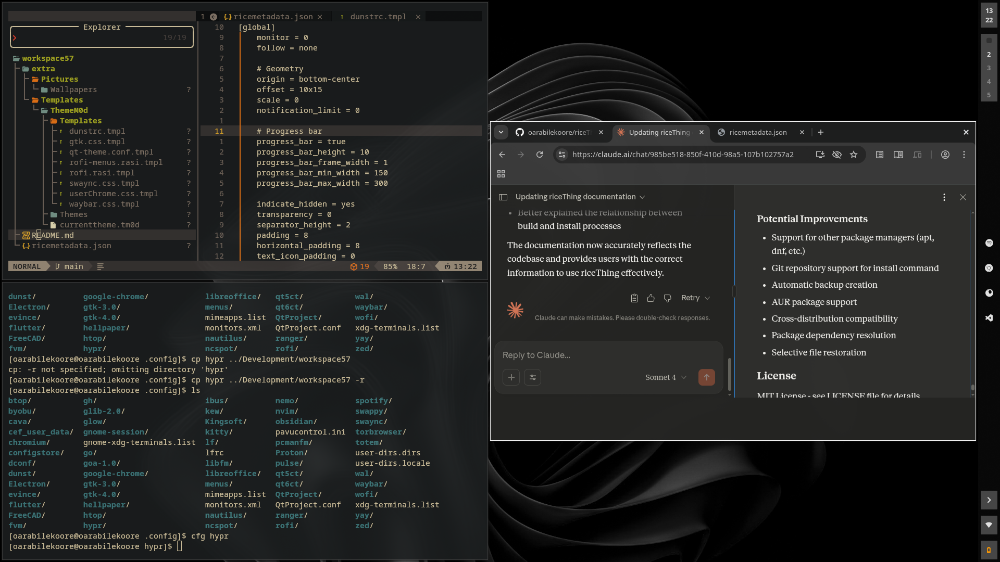

# workspace57

A modern, minimalist Hyprland rice for EndeavourOS featuring custom Bash functions, efficient workflows, and a curated selection of tools for development and daily use.

## Screenshots

### Desktop Overview


### Application Launcher


### Development Environment


## Video Demo

<div align="center">
  <a href="https://youtu.be/VamD6YGK_m0">
</div>

## 🖥️ System Info

- **Distro**: EndeavourOS (Arch-based)
- **WM**: Hyprland
- **Shell**: Bash
- **Terminal**: Kitty
- **Editor**: Neovim
- **Launcher**: Rofi
- **Bar**: Waybar
- **Notifications**: SwayNC
- **Lock Screen**: Hyprlock
- **Idle Daemon**: Hypridle
- **Wallpaper**: Hyprpaper

## 📦 Key Packages

| Package | Version | Purpose |
|---------|---------|---------|
| rofi | 1.7.9.1-1 | Application launcher |
| kitty | 0.42.2-1 | GPU-accelerated terminal |
| neovim | 0.11.3-1 | Modal text editor |
| waybar | 0.14.0-1 | Wayland status bar |
| hyprlock | 0.9.1-1 | Screen locker |
| hypridle | 0.1.6-6 | Idle management daemon |
| hyprpaper | 0.7.5-3 | Wallpaper utility |

## ⚡ Custom Bash Functions

### Development Workflow
- `dev <project>` - Opens a project from `~/Development` with Kitty terminal + Neovim
- `zedv <project>` - Same as `dev` but uses Zed editor instead of Neovim
- `cfg <config>` - Quick access to configuration directories in `~/.config`
- `mkcd <directory>` - Create directory and cd into it in one command

### System Utilities
- `caffeine` - Toggle caffeine mode (prevent sleep)
- `prgnotifier` - Program notifier script
- `sleep` - Suspend system
- `die` - Shutdown system

### Package Management (Pacman)
- `update` - System update (`sudo pacman -Syu`)
- `install` - Install packages (`sudo pacman -S`)
- `remove` - Remove packages with dependencies (`sudo pacman -Rns`)
- `search` - Search packages (`pacman -Ss`)
- `info` - Package information (`pacman -Si`)
- `files` - List package files (`pacman -Ql`)
- `owner` - Find package owner (`pacman -Qo`)
- `rmorphan` - Remove orphaned packages

### Git Shortcuts
- `gpu` - Git push (because we're lazy)
- `gcl` - Git clone

## 📁 Configuration Structure

```
~/.config/
├── hypr/           # Hyprland configuration
├── kitty/          # Terminal configuration
├── rofi/           # Launcher themes and config
├── waybar/         # Status bar configuration
├── swaync/         # Notification center
├── neovim/         # Editor configuration
└── ...
```

## 🎨 Theming with archThemeM0d

This workspace integrates with **archThemeM0d** - an intelligent theming system that generates cohesive color schemes from your wallpaper.

### Dynamic Theme Generation

- **Wallpapers**: `~/Pictures/Wallpapers/`
- **Theme Templates**: `~/Templates/ThemeM0d/`
- **Generated Themes**: Automatically applied to Waybar, Dunst, Rofi, and more

### archThemeM0d Usage

```bash
# Generate theme from current wallpaper
archthemem0d generate

# Build theme templates
archthemem0d build

# Interactive theme editor
archthemem0d serve --port 8080
```

### archThemeM0d Integration

Install and use archThemeM0d for dynamic theming:

```bash
# Install archThemeM0d
git clone https://github.com/yourusername/archThemeM0d.git
cd archThemeM0d
go build -o archthemem0d
sudo mv archthemem0d /usr/local/bin/

# Generate theme from current wallpaper
archthemem0d generate

# Build theme files for applications
archthemem0d build

# Launch interactive theme editor (optional)
archthemem0d serve --port 8080
```

---

*"Simplicity is the ultimate sophistication"* - Keep it clean, keep it functional.

## 🛠️ Development Environment

- **Node.js**: Managed via NVM
- **Bun**: Alternative JavaScript runtime
- **Local binaries**: `~/.local/bin` in PATH

## 📦 Installation Methods

### Method 1: riceThing (Automated)

**riceThing** automatically handles package installation and configuration deployment:

```bash
# Install riceThing
git clone https://github.com/yourusername/riceThing.git
cd riceThing
go build -o ricething
sudo mv ricething /usr/local/bin/

# Install workspace57
git clone https://github.com/yourusername/workspace57.git
ricething install ./workspace57

# Optional: Skip packages or configs
ricething install ./workspace57 --skip-pkgs    # Config files only
ricething install ./workspace57 --skip-configs # Packages only
```

### Method 2: Manual Installation

For users who prefer manual control:

1. **Install packages** (see [Key Packages](#-key-packages) section)
2. **Copy configurations**: `cp -r workspace57/.config/* ~/.config/`
3. **Copy dotfiles**: `cp workspace57/.bashrc ~/`
4. **Source bashrc**: `source ~/.bashrc`

### Method 3: Selective Installation

Use riceThing's selective features to test before full installation:

```bash
# Install configs first to test
ricething install ./workspace57 --skip-pkgs

# If satisfied, install packages
ricething install ./workspace57 --skip-configs
```

## ⚙️ Safety Features

- Interactive file operations (`rm -i`, `cp -i`, `mv -i`)
- Colored output for better visibility
- Fastfetch on terminal startup

## 🎯 Workflow Highlights

This setup is optimized for:
- **Fast project switching** with custom `dev` functions
- **Efficient package management** with memorable aliases
- **Safe file operations** with confirmation prompts
- **Modern development** with Node.js/Bun support
- **Beautiful desktop** with Hyprland compositor

## 🔧 Related Projects

This workspace is built using and integrates with:

### riceThing
A powerful Linux rice packaging and sharing tool that makes desktop configuration portable and shareable.

- **Repository**: [riceThing](https://github.com/oarabilekoore/riceThing)
- **Purpose**: Package and install Linux desktop configurations
- **Features**:
  - Automatic package management
  - Configuration deployment
  - Cross-system compatibility
  - Selective installation options

### archThemeM0d
An intelligent theming system that generates Material 3-compliant color schemes from wallpapers.

- **Repository**: [archThemeM0d](https://github.com/oarabilekoore/archThemeM0d)
- **Purpose**: Dynamic theme generation and management
- **Features**:
  - Wallpaper-based color extraction
  - Material 3 HCT color space
  - Template-based theme generation
  - Interactive web editor
  - Cohesive cross-application theming

Both tools work together to create a seamless, beautiful, and maintainable desktop experience.
